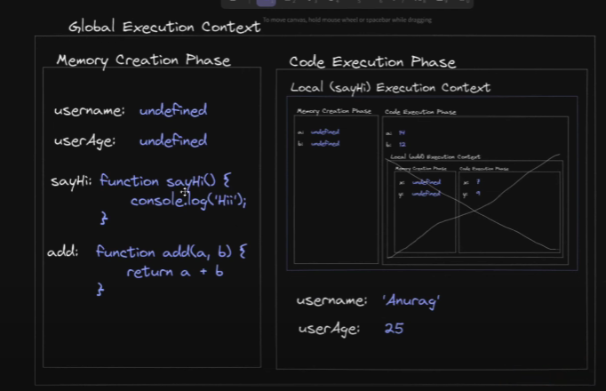

## Temporal Dead Zone (TDZ) :

- The Temporal Dead Zone is a concept introduced in ECMAScript 2015 (ES6) as part of the let and const variable declarations.

- It is a specific region within a scope where variables exist but cannot be accessed until they are assigned a value.

- This zone starts at the beginning of the scope and continues until the point of declaration.

- When a variable is accessed within the TDZ, a ReferenceError is thrown.

- Indicating that the variable is not yet initialized.

### Example :

```
console.log("Hoisting");
console.log(userName);
const userName = "SJR";
console.log(userName);
```

## Hoisting :

JavaScript Hoisting refers to the process whereby the interpreter appears to move the declaration of functions, variables, classes, or imports to the top of their scope, prior to execution of the code.

- In simpler terms as memory creation phase takes place js engine scheme through all the variable and the function .

- where each varible with var comes in global scope and with `undefined` datatype.

- Each let/const variable do not actually get any value as there are in TDZ .

- functions with function declaration , the whole function definition stored in global scope.

- function with function expression & let/const do not works like function definition and hoisting did not work for them .

- And at last in execution Phase it just output the values one by one .

### Function declaration & function definition :

```
hi();
// function definition
//function declaration
function hi() {
  console.log("hi");
}

```

### Function Expression & function definition :

```
sayHi();
//function definition
// function expression as = is there in function definition
const sayHi = () => {
  console.log("sayHi");
};

it will give error in terms of hoisting
```

### var with function expression:

```
sayHi();
//function definition
// function expression as ' = ' sign is there in function definition
var sayHi = function() {
  console.log("sayHi");
};

```

Here `sayHi` will act as variable and it is in global scope and in memory creation phase it will be of data type
`undefined` .

- Unlike in function declaration whole function definition already exist in global scope .

Now when in execution phase js engine see `sayHi()` it will execute as `undefined()` internally which will give error that
`sayHi()` is not a function.
