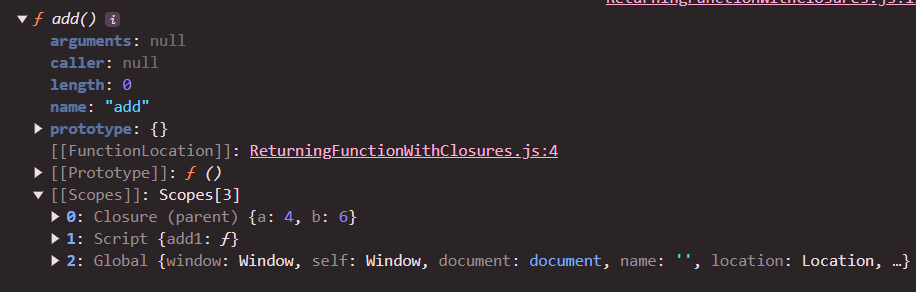
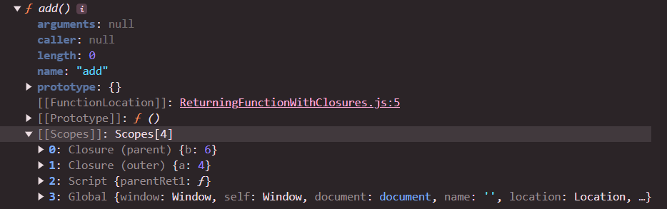

### HigherOrder Function

```
function parent() {
  function add() {
    console.log(a + b);
  }
  return add;
}

const add1 = parent();

```

- A function is Higher Order when it receives a function as argument or it return a function .

- here parent func return `add` function hence `parent` is a Higher Order Function

### Returning Function with Closure:

```function parent() {
  const a = 4;
  const b = 6;
  function add() {
    console.log(a + b);
  }
  return add;
}

const add1 = parent();
```

- Here `parent` not only returns the `add` function but also return its scopes .

- So if a `inner Function uses any outer function variable and the outer function return the inner function then the used variables will be in closure with the parent`



- Here we can clearly see the scopes also returned.

#### For this example :

```function outer() {
  const a = 4;
  function parent() {
    const b = 6;
    function add() {
      console.log(a + b);
    }
    return add;
  }
  return parent();
}

const parentRet1 = outer();
console.dir(parentRet1);
```

- closure :



- we can see that there is 2 closure
