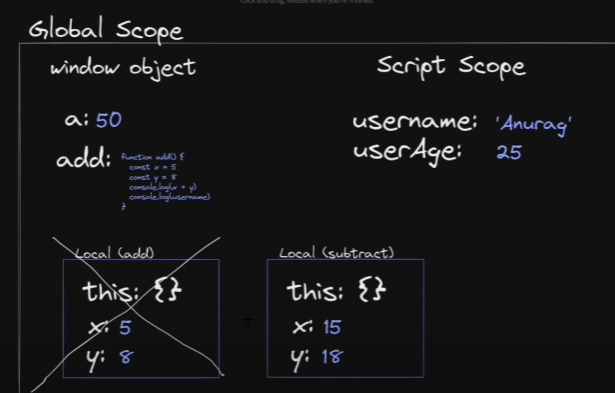
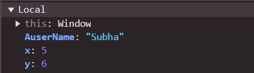
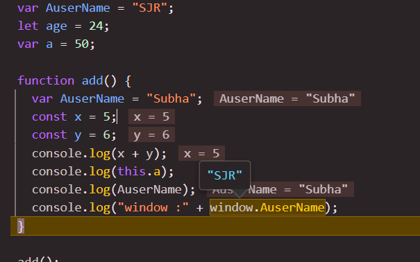
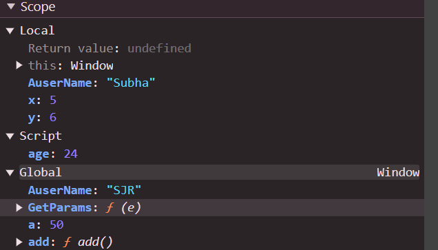

### Global vs Local Scope:



- A global scope is divided into Two:

  - 1. window Object (all var declaration , function etc..)

  - 2. Script Scope (let/const declared variable)

### Local Scope :

- A scope create inside global scope for ex. function add
  a local scope will be created with :
  - this (window object)
  - and variable local to the function



#### Above local scope is for below add function

```
function add() {
  const userName = "Subha";
  const x = 5;
  const y = 6;
  console.log(x + y);
  console.log(this.a);
  console.log(userName);
  console.log("window :" + this.userName); // o/p:undefined
}
```

- Now the `console.log(userName);` will print the nearest userName variable value if the value is not in local scope it will go outside to check with global scope.

* Local scope variables are bound in the local Scope only they can not be accessed in global scope

### Functional scope/Local Scope vs Block Scope:

- let/const is a Block scope
- var is function scope

### Lexical scope :

```
function child() {
  const childName = "golu jr.";
  console.log(childName);
  // access to all parents variable

  function grandChild() {
    const grandChild = "golu jr. jr.";
    console.log(grandChild);
    var zz = "here in grand ";
    console.log(zz);
  }
  grandChild();
  // console.log("child  -> :" + zz); //error
}

console.log(userName);
child();

```

- Here lexical scope of GrandChild is :

  - its own local scope
  - all its parents scope
  - global scope

- Means the Grandchild function will actually has the access to all of its outer parent scopes and global scope

- variables of outer scope used in inner scope will lead to closures of the used variable.

### Block scope:

```{
  let hello = "hello";
  console.log(hello);
  console.log({ userName, age });
  var yeos = "1225";
}
 console.log("inside sub :" + yeos);
 console.log("inside sub :" + hello);
```

- as var is function scope it can be accessed outside the block but let/const declaration can not be accessed outside the block (eg. if ,for , while )

### Important concept:

```
const userName = "SJR";
var AsureName = "GR"
let age = 24;
var a = 50;

function add() {
const userName = "Subha";
var AuserName = "golujr";
const x = 5;
const y = 6;
console.log(x + y); // 11
console.log(this.a); // 50
console.log(userName); // Subha
console.log("window :" + this.AuserName); //GR
console.log("window :" + this.userName); //undefined
}

add();
```

- Now the `userName` is a Const Declaration hence it'll be in script scope of Global scope. And can not be accessed with
  `window.userName` or `this.userName`.

- Now this `AuserName` is a `var` declaration and can be accessed with `window.userName` or `this.userName`.





- Now you can see that `AuserName` in attach to the `global scope` hence can be accessed with `window object`
