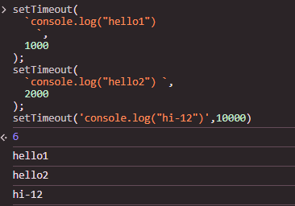
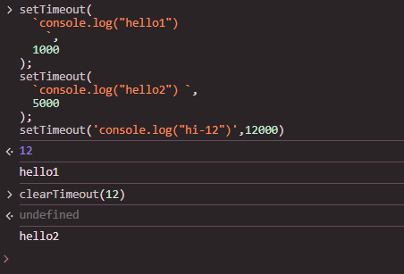
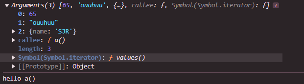

### setTimeout() and setTimeInterval():

- Inside the parenthesis it converts any string to code actually to execute that .
- Example:

  ```
  setTimeout(
  `console.log("hello")
    console.log("world")
    `,
  1000
  );
  ```

  - here that `console.log("hello")` string converts to code and outputs `hello`.
  - it takes `timeout as second argument` `timeout means after how many sec later it will execute.`

### setTimeout Return valiue i.e Timer Id:

- ` setTimeout returns some values which is the id of the timer .`
- `With this timer id we can clear the concerned setTimeout before execution.`

#### Code:

```
setTimeout(`console.log("hello1")`,1000);
setTimeout(`console.log("hello2") `,5000);
setTimeout('console.log("hi-12")',12000)
```

- `here The timer Id is of the last setTimeout()`



- Now From the above execution we can see that `timer id of last setTimeout is 6 .`

- Now we don't want to execute the last `setTimeout` then we Can clear the Timeout using `clearTimeout(Timer id of any setTimeout that we have captured ina variable)`



- we can get the id of setTimeout by this :

  ```
   const id = setTimeout(`console.log('hi3')`, 3000);

  ```

  ### Arguments of setTimeout():

  - `setTimeout(callbackFunctionName , timeOut , arguments)`

  - ##### callback function -> do not execute it just provide the name .
  - ##### timeOut : After how many sec later the function will execute
  - #### `Arguments : we can send any values like int , string,array , obj and these values will be accessible to the callback function through argument keyword `

#### Ex:

```
function a() {
  console.log(arguments);

  console.log("hello a()");
}

const ideNew = setTimeout(a, 2000, 65, "ouuhuu", { name: "SJR" });
```

#### outPut:


